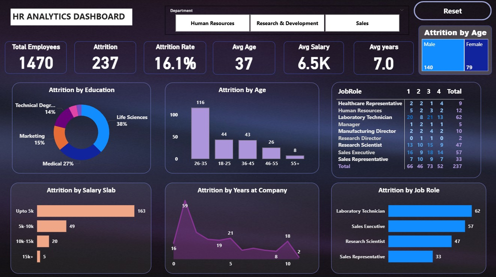

# HR Analytics Dashboard

## Project Title
HR Analytics Dashboard for Employee Attrition Analysis

## Project Overview
This project analyzes employee attrition patterns using Microsoft Power BI.  
The dashboard helps identify key factors influencing employee turnover such as age group, salary range, job role, education level, and years at the company.  
The goal of this project is to support HR departments in making data-driven decisions to improve employee retention.

## Objective
The objective of this project is to analyze employee attrition patterns and identify the factors affecting employee turnover using interactive data visualizations.

## Tools & Technologies Used
- Microsoft Power BI
- Power Query
- DAX (Data Analysis Expressions)
- Data Visualization

## Dataset
The project uses an HR Analytics dataset containing employee information such as:
- Department
- Age
- Salary
- Job Role
- Education
- Years at Company
- Attrition Status

## Dashboard Insights
The dashboard analyzes employee attrition based on:
- Age Group
- Salary Range
- Job Role
- Education Level
- Years at Company

## Dashboard Preview


## Project Structure
```
HR-Analytics-Dashboard
│
├── HR_Analytics_Dashboard.pbix
├── HR_Analytics_Dataset.csv
├── dashboard.png
└── README.md
```

## Key Insights
- Employee attrition rate is approximately 16%.
- Higher attrition is observed in the 26–35 age group.
- Employees in lower salary ranges show higher attrition.
- Certain job roles experience higher employee turnover.
- Attrition varies across education levels and departments.

## Conclusion
The HR Analytics Dashboard provides meaningful insights into employee attrition trends.  
It enables HR teams to understand workforce patterns and make better decisions to improve employee retention and organizational productivity.
